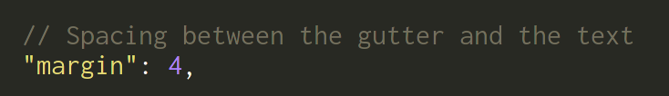
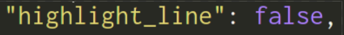
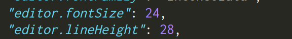
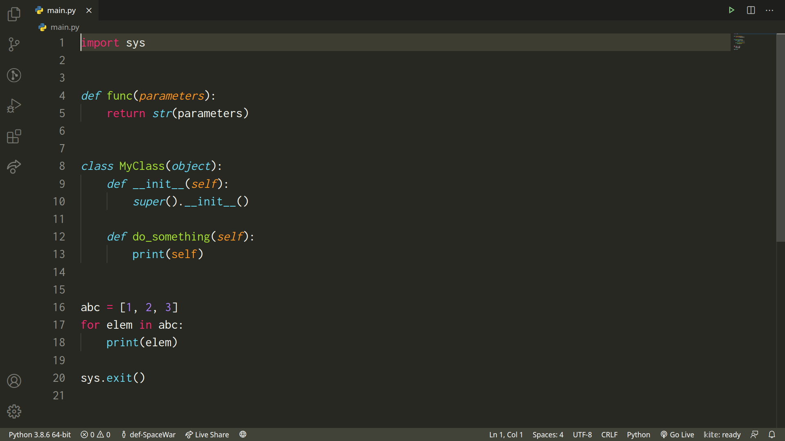

# Sublime Monokai

This is a theme meant for sublime text users who love monokai!

To get the full experience goto your settings.json by doing `Ctrl+Shift+P` and finding `Preferences: Open Settings (JSON)`.

```json
"editor.semanticTokenColorCustomizations": {
    "enabled": true // enable for all themes
},
```

And you'll also need to make sure that in your settings.json to get the full sublime-like experience:

```json
"editor.lineHeight": yourFontSize + 4,
"editor.renderLineHighlight": "none",
```

since



<br />



Which is in the default sublime text settings and what makes it so beautiful.

This is mine:



Screenshot:


